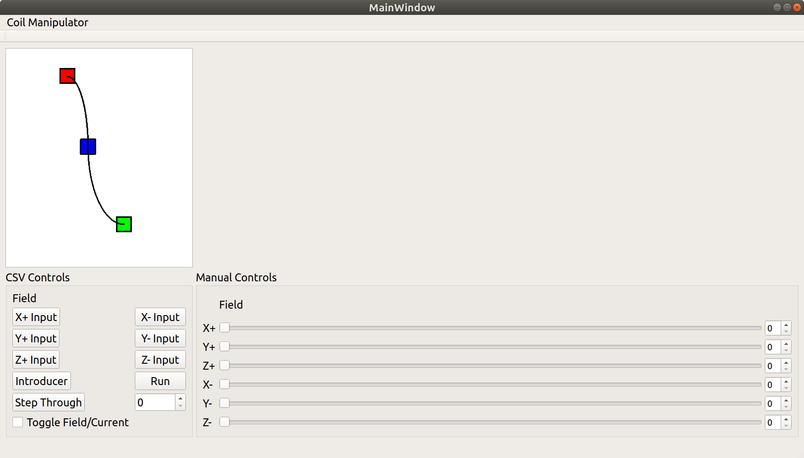
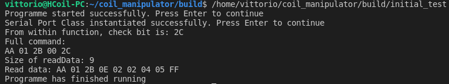

# Helmz Coil Manipulator

# Dependencies

## Functional

* Clone and install [CppLinuxSerial](https://github.com/VFrancescon/CppLinuxSerial) following the instructions given there.*
* Install the [Pylon SDK](https://www.baslerweb.com/en/sales-support/downloads/software-downloads/) with mpg4 addon.

\*PLEASE NOTE:
We use my fork of the library as the original repo currently do not support setting flow control at run time.
I put a merge request out and hopefullythey will soon and we can resume to using their release branch.

## Documentation

* [Doxygen](https://www.doxygen.nl/download.html#srcbin)

\*NOTE: Follow [this](https://devblogs.microsoft.com/cppblog/clear-functional-c-documentation-with-sphinx-breathe-doxygen-cmake/) guide for detailed instructions. It was decided Sphinx was not worth it, so we only need the Doxygen section.
Also, for compatibility, install from source. The bins and apt packages hate working on ubuntu 18.

# Build Instructions

1. In ~/coil_manipulator

2. Execute


```
mkdir build && cd build
cmake ..
sudo make install
```
3. You are ready to go!

### Note

`sudo make install` is only required if the files in the libs/ directory are modified.

```
That is because the libraries are installed on the system in /usr/local/include. 
Which allows you to include the libraries direclty into any application written for the system. 
Only needing to link_libraries in the CMAKE.
```

Else, you can just run `make` optionally specifying which executable to compile.
Example: `make initial_test` or `make all`

The Doxygen documentation can be built with `make Doxygen`. Once built, it can be accessed by opening the index.html file generated with your favourite browser.

E.g. (assuming you are in build/ and have compiled the project fully):

`firefox docs/html/index.html`

# Features
* Completely C/C++ Based
* Qt5 Frontend
* Basler Pylon + OpenCV integration (prototype)
* Low level library written for Serial Comm to PSUs
* Low level library written for SCPI Comm to Teslameter (Lakeshore F71)
* Low Level library written for Serial Comm to Linear Actuator

# Currently in Progress
* Middleware Layer that abstracts all low-level libraries.

# Screenshots


# Credits
* [Geoffry Hunter](https://github.com/gbmhunter/CppLinuxSerial) for the Serial Comm C++ Class
