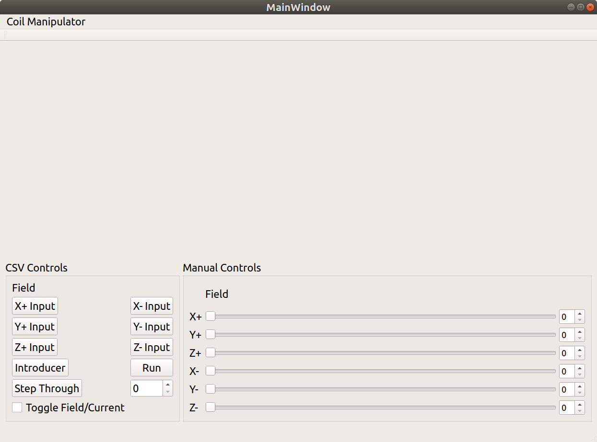

# Helmz Coil Manipulator echo

# Features
* Completely C/C++ Based
* Qt5 Frontend

# Current Progress
* Integrated CppLinuxSerial Library (see credits) - Untested
* Formatted message can be sent
* No reception verified yet
* Most of the documentation transcribed on Notion
* Initial Frontend Design
* File (csv) and Manual input prototype written

* Screenshots

# Credits
* [Geoffry Hunter](https://github.com/gbmhunter/CppLinuxSerial) for the Serial Comm C++ Class
